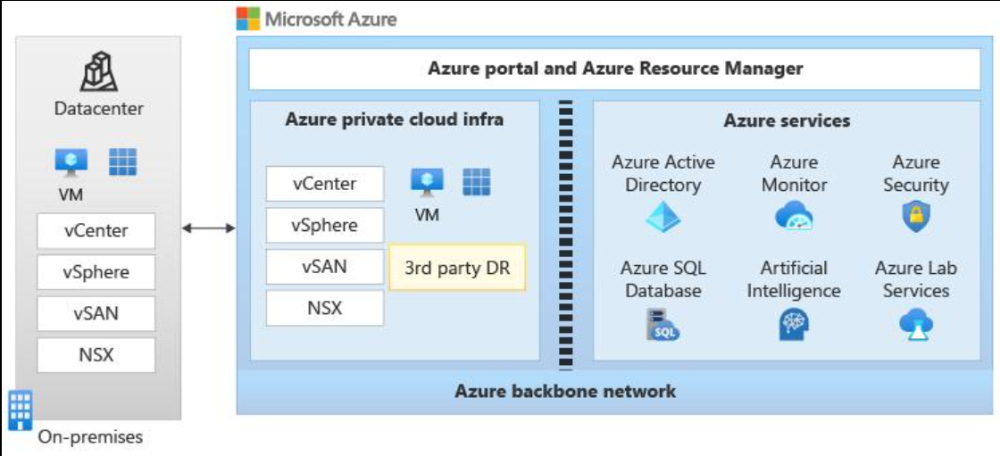
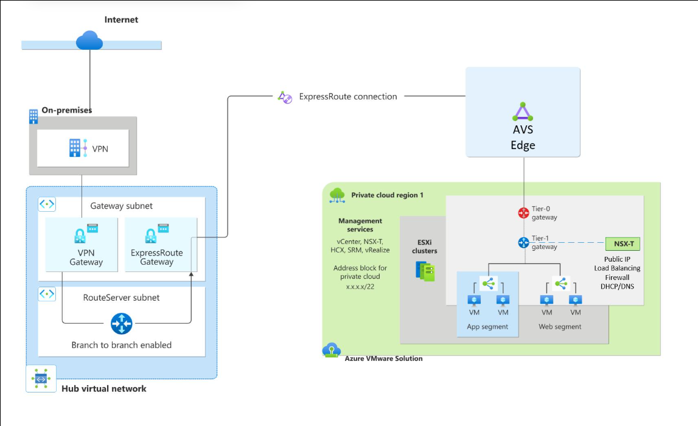
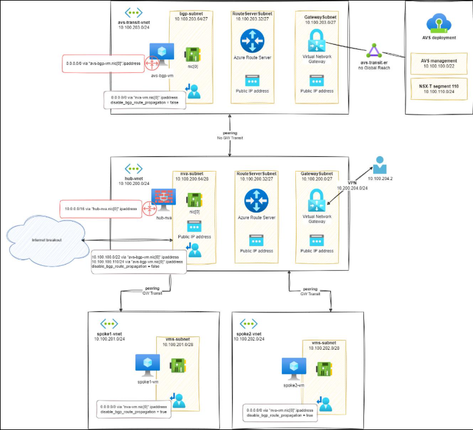

# 1. Create a repeatable, isolated, known-good software environment that sales/marketing can start, stop, reset, and recreate without an engineer.

## Demo env.

```
                GitHub
                   │
                   ▼
          GitHub Actions
                   │
        ┌──────────┴──────────┐
        │                     │
     Terraform              Packer
        │                     │
        ▼                     ▼
 Azure / AVS             Golden Images
        │
        ▼
 ┌──────────────────────────────┐
 │      Demo Environment #01    │
 │                              │
 │ Windows VM                   │
 │ Application                  │
 │ PostgreSQL / MySQL           │
 │ Configuration                │
 │ Test data                    │
 └──────────────────────────────┘
        │
        ▼
   Sales Demo / Testing
```

## Important automation

```
CREATE
  ↓
Provision VM
  ↓
Configure Windows
  ↓
Install application
  ↓
Restore database
  ↓
Apply configuration
  ↓
Health checks
  ↓
READY
```

## Stop application

```
RESET
  ↓
Stop application
  ↓
Restore known-good DB backup
  ↓
Reset configuration/data
  ↓
Run health checks
  ↓
READY FOR NEXT DEMO
```

## 
```
DESTROY
  ↓
Terraform destroy
  ↓
Environment disappears
```

# 2. Spend your first preparation session on Azure

## Azure fundamentals

```
Subscription
   │
Resource Group
   │
VNet
   ├── Subnet
   ├── NSG
   └── VM
```

Understand:

Azure Resource Group
VNet
Subnet
NSG
Private/Public IP
Managed Identity
Azure Storage
Azure VM
Azure Key Vault
Azure Monitor
Azure DevOps vs GitHub Actions

| Azure concept        | Quick definition                                                                                                          | AWS equivalent                                                                  |
| -------------------- | ------------------------------------------------------------------------------------------------------------------------- | ------------------------------------------------------------------------------- |
| **Resource Group**   | Logical container used to organize and manage related Azure resources together.                                           | Roughly CloudFormation stack / organizational grouping, **no exact equivalent** |
| **VNet**             | Private network in Azure where resources communicate with each other.                                                     | **VPC**                                                                         |
| **Subnet**           | A smaller network segment inside a VNet used to organize/isolate resources.                                               | **VPC Subnet**                                                                  |
| **NSG**              | Network Security Group; contains inbound/outbound traffic rules controlling network access to resources/subnets.          | **Security Group** (closest)                                                    |
| **Private IP**       | Internal IP address used for communication within a VNet/private network.                                                 | **Private IP on ENI**                                                           |
| **Public IP**        | Internet-routable IP address assigned to a resource when external access is required.                                     | **Elastic/Public IP**                                                           |
| **Managed Identity** | Azure-managed identity that lets a resource authenticate to other Azure services **without storing credentials/secrets**. | Roughly **IAM Role attached to EC2**                                            |
| **Azure Storage**    | Azure's storage services for objects/files/disks/queues, etc. Blob Storage is commonly used for objects.                  | **S3** for Blob Storage                                                         |
| **Azure VM**         | Virtual machine running an OS such as Windows or Linux in Azure.                                                          | **EC2**                                                                         |
| **Azure Key Vault**  | Securely stores and manages secrets, keys and certificates.                                                               | Roughly **AWS Secrets Manager + KMS**                                           |
| **Azure Monitor**    | Azure's monitoring/observability platform for metrics, logs, alerts and application/resource health.                      | **CloudWatch**                                                                  |


## AWS vs Azure

AWS:
```
Account
  ↓
VPC
  ↓
Subnet
  ↓
Security Group
  ↓
EC2
```

Azure:
```
Subscription
  ↓
Resource Group
  ↓
VNet
  ↓
Subnet
  ↓
NSG
  ↓
VM
```


# 3. AVS is the one thing I'd specifically study









## How It Works
- Dedicated Hardware: AVS runs on dedicated, bare-metal Azure infrastructure (hyperconverged hosts) isolated for your organization.

- Native Stack: Every private cloud comes pre-configured with the full VMware stack: vSphere (compute), vSAN (storage), NSX (networking), and vCenter (management).

- License Portability: You bring your own portable VMware Cloud Foundation (VCF) subscription and license keys from Broadcom.

- Microsoft Management: Microsoft manages and maintains the physical infrastructure, patching, and lifecycle upgrades.

## Simple model:

**Azure VMware Solution** (AVS) is a fully managed Microsoft service that lets you run your VMware workloads natively in the Microsoft Azure cloud.

```

                    Azure
                      │
              ┌───────┴────────┐
              │                 │
        Azure Services      AVS Private Cloud
                                │
                         VMware vSphere
                                │
                         ┌──────┴──────┐
                         │             │
                       ESXi         vCenter
                         │
                  Windows VMs
                         │
              ┌──────────┴──────────┐
              │                     │
          Application          PostgreSQL/MySQL
```

AVS essentially gives the organization a VMware environment hosted in Azure.

I haven't worked directly with AVS in production, but I understand the architecture. AVS provides a VMware private cloud in Azure, so the infrastructure automation concepts I'm familiar with still apply. My Terraform experience would translate particularly well, while I'd need to learn the organization's specific AVS networking, vSphere and VM provisioning patterns.


# 4. Terraform should be your strongest talking point

You already have substantial Terraform experience, so prepare an architecture like:

```
GitHub
   │
   │ Pull Request
   ▼
Terraform
   │
   ├── Network
   ├── VM
   ├── Storage
   ├── Security
   └── Environment configuration
```

then: 

```
terraform plan
      ↓
approval
      ↓
terraform apply
      ↓
environment created
```

## Remote state

You can talk about your existing experience with:

- Terraform remote state
- state locking
- state recovery
- reusable modules
- multi-environment deployments


One thing I consider important for this type of platform is keeping Terraform state centralized and protected, because we're potentially managing 10–20 environments and we don't want engineers manipulating state locally.


# 5. Packer is probably your biggest technical preparation item

Without Packer:
```
VM
 ↓
Install Windows
 ↓
Install application
 ↓
Install dependencies
 ↓
Configure
 ↓
Every deployment repeats this
```

With Packer:
```
Windows base image
       ↓
Packer
       ↓
Install dependencies
       ↓
Install application components
       ↓
Configure
       ↓
Golden Image
       ↓
Terraform
       ↓
10–20 VMs
```

I would use Packer to create versioned golden images rather than doing all application and OS configuration from scratch every time a VM is created. Terraform would then consume the approved image.

Important concepts:

- base image
- provisioning
- versioning
- immutable image
- image validation
- image promotion
- rollback

# 6. Powershell

My strongest scripting experience has been Bash/Shell and automation around Linux/cloud infrastructure, but I've also worked with Windows environments and PowerShell in my current role. I'm comfortable picking up PowerShell quickly because the automation patterns—parameters, conditionals, error handling, REST APIs, logging and idempotency—are transferable.

```
Get-Service
Get-Process
Get-ComputerInfo
Get-ChildItem
Test-Connection
Test-NetConnection
Get-WindowsFeature
Get-EventLog
Restart-Service
Stop-Service
Start-Service
```

# 7. Github Self hosted runner

If the workflow needs access to private infrastructure, internal networks, specific tooling, Windows-specific dependencies, or controlled execution environments, a self-hosted runner can make sense. I'd also treat the runner as infrastructure itself—controlled permissions, patching, isolation, monitoring and preferably ephemeral runners where practical.

```
GitHub
   │
   ▼
GitHub Actions
   │
   ▼
Self-hosted Windows Runner
   │
   ├── PowerShell
   ├── Terraform
   ├── Packer
   └── Azure CLI
```

# 8. Github Rest APIs

Know that GitHub has REST APIs for things like:

- Repositories
- Workflows
- Actions
- Workflow runs
- Issues
- Pull requests
- Branches
- Secrets/configuration

## Demo workflow:

```
Sales user
   ↓
Internal tool / request
   ↓
GitHub API
   ↓
Trigger GitHub Actions
   ↓
Terraform
   ↓
Demo environment
```

## How would you make the process idiot-proof?

I wouldn't expect a salesperson to run Terraform. I'd expose a controlled workflow through GitHub Actions, potentially triggered through the GitHub API, where the user selects an environment/version and the automation handles provisioning, validation and reset.


# 9. Database preparation

Know the lifecycle:

```
Known-good DB backup
        ↓
    Restore
        ↓
   Demo environment
        ↓
      Demo
        ↓
      Reset
        ↓
Restore known-good backup
```

Understand:

- backup
- restore
- dump
- snapshot
- point-in-time recovery
- credentials/secrets
- connection strings
- database health checks
- validation after restore


## How would you make a reset reliable?

I wouldn't simply restart the VM. I'd define a known-good baseline for the application and database, automate the restore process, validate database connectivity and application health afterward, and make the workflow idempotent so that running reset multiple times produces the same expected state.


# 10. Security: map your Snyk experience to Polaris

our existing security experience is valuable here.

You already know:

- IaC scanning
- dependency scanning
- container scanning
- vulnerability remediation
- CI/CD security gates
- scheduled scans
- centralized reporting

```
Developer
   ↓
GitHub PR
   ↓
Security Scan
   ├── IaC
   ├── Dependencies
   ├── Code
   └── Containers
        ↓
    Policy Gate
        ↓
      Build
```

I understand how to integrate security into CI/CD rather than treating security as a separate manual step.


# 11. AI

I use AI as an engineering accelerator, not as an authority. I use it to generate boilerplate, troubleshoot errors, explain unfamiliar APIs, improve scripts and accelerate documentation, but I still review the generated code, test it and validate security implications.


# 12. Your strongest interview story

At EXFO, I worked extensively with Terraform to manage cloud infrastructure across AWS, including EKS, RDS, networking, IAM and supporting services. We built reusable modules and automated deployments through CI/CD. I also worked on security scanning and remediation, and on operational issues such as recovering Terraform state and improving infrastructure reliability.

So although the target environment here is Azure/AVS and GitHub Actions rather than AWS/GitLab, the underlying problems—repeatability, infrastructure as code, automation, security and operational reliability—are very familiar to me.


# 13. One architecture you should be able to draw from memory

```
                       GitHub
                          │
                ┌─────────┴─────────┐
                │                   │
             PR / Code        Manual Trigger
                │                   │
                └─────────┬─────────┘
                          ▼
                  GitHub Actions
                          │
              ┌───────────┼───────────┐
              │           │           │
          Security     Packer      Terraform
          Scanning        │           │
              │           ▼           │
              │      Golden Image     │
              │                       │
              └───────────┬───────────┘
                          ▼
                    Azure / AVS
                          │
             ┌────────────┴────────────┐
             │                         │
          Windows VM              DB Server
             │                  PostgreSQL/MySQL
             │                         │
             └────────────┬────────────┘
                          ▼
                    Demo Environment
                          │
               ┌──────────┼──────────┐
               │          │          │
             CREATE      RESET     DESTROY
```