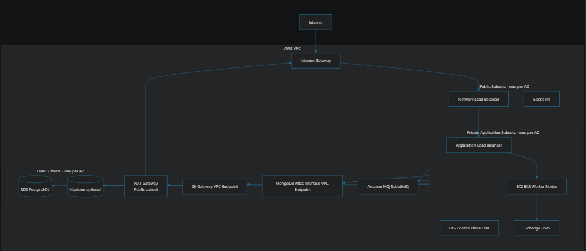

# AWS
VPC level
Subnet level
Instance level

## Inbound traffic (request flow from internet to resources)
Internet -> IGW(VPC) -> Public subnet -> Load balancer(Public subnet) -> Target group(VPC) -> route table(VPC) -> private subnet(VPC) -> Security group(Instance) -> resources (private subnet)

Internet➡️ Internet Gateway (IGW)➡️ Public Subnet (Where your public-facing load balancer lives)➡️ Load Balancer (Receives the traffic, evaluates its listener rules, and forwards it to a Target Group)➡️ Target Group (Applies health checks and routing logic to select a specific backend resource)➡️ Route Table (Directs the forwarded traffic from the public subnet to the private subnet)➡️ Private Subnet➡️ Security Group (Firewall that permits or denies the traffic entering the resource)➡️ Resources (Your EC2 instances, ECS tasks, etc.)

## Outbound traffic (request flow from application to internet)

Application(private subnet) -> Security group(Instance) -> Route table(VPC) -> Firewall inspection/Gateway Load Balancer(Public subnet) -> NAT Gateway(Public subnet) -> IGW(VPC) -> Internet


# Others

- NAT Gateway: Does the IP address masking so that the internet doesn't have the IP address of the application or resources.

- NACL(Subnet level, Stateless) vs security group(Instance level, Stateful)

In AWS, a Security Group acts as a stateful(Only Allow), instance-level virtual firewall, while a Network Access Control List (NACL) acts as a stateless(Allow+Deny), subnet-level virtual firewall.

- Security is a shared responsibility in AWS.

- DNS: Domain Name System, DNS resolved to the Load Balancer IP address.

- Route 53: Traffic resolution, Health checks

Route53 -> Hosted zone -> DNS records -> Ip address(LB)

- Autoscaling group: Logical collection of EC2 instances treated as a single unit for automatic scaling, health checks, and fleet management. Can be used in case of multiple AZ and to handle high traffic.

- Target group

- Elastic IP address: An Elastic IP (EIP) is a static, public IPv4 address from Amazon Web Services used for dynamic cloud computing. IP address that never changes.

# AWS Project

- Create a VPC with multi AZ.
- Create an A**utoscaling group** with a launch template(Use above VPC) in the private subnets.
- Create a Bastion host in the public subnet(Use above VPC) with a public address.
- SCP the pem file to the bastion host.
- Test ssh using the Private IP of the EC2 instances created in the private subnet from the bastion host in public subnet.
- Create a target group, like launch templates(Use above VPC and EC2 instances) with the right port the application is exposing in the private subnet.
- Create ALB(L7), Internet facing in the public subnet, having access from the IGW selecting the above target group.
- Make sure open the ports in security groups as needed.

# Why we front the ALB instead of NLB?

We front an Application Load Balancer (ALB) instead of a Network Load Balancer (NLB) for HTTP/HTTPS workloads because the ALB understands application data.

## 💡 Layer 7 vs. Layer 4 Intelligence

- ALB (Layer 7): Inspects HTTP/HTTPS headers, paths, and hostnames to make smart routing decisions.
- NLB (Layer 4): Forwards raw TCP/UDP packets based only on IP and port numbers without inspecting content.

## ✅ Why Choose ALB as the Front Door

- Path & Host Routing: Send `/images` to one target group and `/api` to another using a single load balancer.
- SSL/TLS Termination: Offloads certificates centrally while simplifying backend security configurations.
- Security Integration: Integrates natively with AWS WAF to block web attacks, SQL injection, and DDoS attempts.
- Advanced Features: Handles HTTP-to-HTTPS redirects, sticky sessions, and fixed error responses natively.

## ⚠️ When You Would Front an NLB Instead

- Static IPs(EIP): Requires fixed Elastic IPs per Availability Zone for strict client whitelisting.
- Extreme Scale: Handles millions of requests per second with ultra-low latency for gaming or IoT.
- Non-HTTP Traffic: Manages raw TCP or UDP protocols that an ALB cannot interpret.

# workflow diagram in case of NLB in front

```
[ CLIENT ] 
  │ Public IP: 198.51.100.45
  │
  ▼ Target: 203.0.113.10 (NLB Static IP)
┌────────────────────────────────────────────────────────┐
│ AWS VPC (Virtual Private Cloud)                        │
│                                                        │
│   [ Network Load Balancer (NLB) ]                      │
│     │ Static Public IP: 203.0.113.10                   │
│     │ (Preserves client Source IP)                     │
│     │                                                  │
│     ▼ Target: 10.0.1.25 (ALB Internal IP)              │
│                                                        │
│   [ Application Load Balancer (ALB) ]                  │
│     │ Dynamic Private IPs: 10.0.1.25 / 10.0.2.82       │
│     │ (Terminates SSL, evaluates L7 rules,             │
│     │  injects X-Forwarded-For: 198.51.100.45)         │
│     │                                                  │
│     ▼ Target: 10.0.1.100 (EC2 Internal IP)             │
│                                                        │
│   [ Target Backend / EC2 Instances ]                   │
│       Private IPs: 10.0.1.100 / 10.0.2.100             │
└────────────────────────────────────────────────────────┘
```


# workflow diagram ALB in front

```
[ CLIENT ] 
  │ Public IP: 198.51.100.45
  │
  ▼ Target: 3.22.91.40 (ALB Dynamic Public IP via Route 53)
┌────────────────────────────────────────────────────────┐
│ AWS VPC (Virtual Private Cloud)                        │
│                                                        │
│   [ Application Load Balancer (ALB) ]                  │
│     │ Dynamic Public IPs: 3.22.91.40 / 54.10.12.85     │
│     │ (Terminates SSL, evaluates L7 rules,             │
│     │  initiates NEW internal TCP connection)          │
│     │                                                  │
│     ▼ Target: 10.0.3.15 (NLB Internal Private IP)      │
│                                                        │
│   [ Network Load Balancer (NLB) ]                      │
│     │ Static Private IP: 10.0.3.15                     │
│     │ (Sees ALB's private IP as the traffic source;    │
│     │  cannot read HTTP headers)                       │
│     │                                                  │
│     ▼ Target: 10.0.3.200 (Backend Internal IP)         │
│                                                        │
│   [ Target Backend / Non-HTTP Service ]                │
│       Private IP: 10.0.3.200                           │
└────────────────────────────────────────────────────────┘
```

# What is the advantage of having NLB in front of ALB

Placing an NLB in front of an ALB gives you the "best of both worlds." You combine the ultra-high performance and static networking of Layer 4 with the smart, application-aware routing of Layer 7.

The core advantages of this architecture include:

## 🌐 1. Static IP Addresses(EIP) for Client WhitelistingThe Problem: 

- An ALB's IP addresses change dynamically as AWS scales it up or down. If your corporate clients have strict firewalls and require a single, unchanging IP address (or range) to whitelist, you cannot give them an ALB URL

- The Solution: An NLB provides fixed, static Elastic IPs (**one per Availability Zone**) that never change. Clients whitelist these static IPs, and the NLB seamlessly forwards the traffic to your dynamic ALB backend.

## ⚡ 2. Handling Massive, Sudden Traffic Spikes (Flash Crowds)

- The Problem: ALBs scale out gradually. If you experience an instantaneous burst of millions of requests per second (e.g., a high-profile ticket launch or a flash sale), an ALB can drop connections while it attempts to scale.

- The Solution: NLBs are architected to handle millions of requests per second with ultra-low latency out of the box without needing to warm up or scale. The NLB absorbs the massive initial wave of traffic and distributes it evenly across the ALB nodes.

# WAF

Filtering Unauthorized Traffic: By using AWS WAF (Web Application Firewall) and custom headers, CloudFront stops malicious traffic (such as bots or invalid requests) from reaching the application.

```
[ Internet ] 
     │
     ▼
┌─────────────────────────┐
│ Network Load Balancer   │  ◄── Receives raw TCP/UDP traffic.
└───────────┬─────────────┘      (WAF is NOT active here)
            │
            ▼
┌─────────────────────────┐
│ Application Load Balancer│ ◄── Terminates TLS/SSL.
│   ┌─────────────────┐   │
│   │     AWS WAF     │   │  ◄── WAF inspects the unencrypted HTTP/HTTPS 
│   └────────┬────────┘   │      request here BEFORE forwarding to backends.
└────────────┼────────────┘
             ▼
    [ Target Group / EC2 ]
```

# 2 tier vs 3 tier architecture vs EXFO architecture

High-Level Architecture:

This stack is best described as a logical 3-tier architecture implemented on a Kubernetes platform, with additional managed services around it.

The main composition is in terraform/modules/exchange/main.tf. The root stack creates one exchange module from terraform/main.tf.

## Request workflow:

```

Client
  |
  | DNS lookup: *.environment.exfodevlab.com
  v
Route 53
  |
  | A record returns NLB Elastic IP addresses
  v
Public NLB
  |
  | TCP 443 forwarding
  | Target type: ALB
  v
ALB
  |
  | HTTPS 443
  | ACM certificate
  | WAF rate limiting and IP whitelist
  | Listener rule forwards all paths
  v
EKS NodePort Target Group
  |
  | HTTP, configured on port 80
  v
EKS Worker Nodes
  |
  v
Exchange Kubernetes Services and Pods
```

The gateway implementation is in terraform/modules/gateway/main.tf.

Important details:

The NLB is internet-facing.
Each public subnet receives an Elastic IP.
Route 53 returns those Elastic IPs through an A record.
The NLB listener accepts TCP 443.
The NLB forwards traffic to the ALB on TCP 443.
The ALB terminates TLS using an ACM certificate.
The ALB forwards HTTP traffic to the EKS cluster target group.
The target group is configured for the cluster’s NodePort.
WAF is associated with the ALB.
The wildcard DNS record is created by the DNS module in terraform/modules/dns/main.tf.

## Tier Classification

### Presentation / Ingress Tier

```
Route 53
  |
Public NLB
  |
ALB
  |
WAF and ACM
```

The NLB and ALB together provide the public presentation and ingress layer.

### Application Tier

```
EKS Cluster
  |
EC2 Worker Nodes
  |
Kubernetes Ingress / Services / Pods
  |
Exchange microservices
```

The EKS cluster hosts the web applications, APIs, background services, reporting services, and other Exchange workloads.

### Data and Integration Tier

```
RDS PostgreSQL
MongoDB Atlas through AWS PrivateLink
Amazon MQ RabbitMQ
Amazon S3
Amazon Neptune, optional
AWS IoT Core, optional
Step Functions and Lambda, optional
```

### Overall

```
Internet
   |
Route 53
   |
NLB
   |
ALB + WAF + ACM
   |
EKS application workloads
   |
Databases, queues, object storage, and integration services
```

This is not a strict physical 3-tier deployment where separate EC2 groups represent web, application, and database tiers. Instead, it is a logical 3-tier architecture:

Ingress/presentation: NLB and ALB
Application: EKS workloads
Data/integration: RDS, MongoDB, RabbitMQ, S3, and optional services
It is more than a simple 2-tier design because the application workloads and data services are separate layers.

## VPC and Networking Workflow (Very important)



The networking module is in terraform/modules/networking/main.tf.

## Subnet Layout

The VPC is divided across the configured Availability Zones, which default to three AZs:

```
VPC
|
+-- Public Subnets
|   +-- NLB Elastic IP mappings
|   +-- NAT Gateway
|   +-- Internet Gateway route
|
+-- Private Application Subnets
|   +-- ALB
|   +-- EKS control-plane networking
|   +-- EKS worker nodes
|   +-- Kubernetes workloads
|   +-- NAT Gateway route for outbound access
|
+-- Data Subnets
    +-- RDS PostgreSQL
    +-- Neptune, when enabled
    +-- Separate data security group
```


## Inbound Network Flow (Repeat of Request workflow above)

```
Client public IP
   |
   v
Route 53 DNS name
   |
   v
NLB Elastic IP in a public subnet
   |
   | TCP 443
   v
ALB in application subnets
   |
   | HTTPS termination
   | WAF inspection
   | HTTP forwarding
   v
EKS NodePort
   |
   v
Kubernetes Service
   |
   v
Exchange Pod
```

The NLB is responsible for transport-level forwarding. The ALB is responsible for application-level HTTPS processing and listener rules.

The ALB security group currently allows inbound TCP 443 from 0.0.0.0/0. Although the comment says traffic comes from the NLB, the Terraform rule is broader than only allowing NLB traffic.

## Outbound Network Flow

```
EKS Pod or Worker Node
   |
   v
Private Application Subnet
   |
   v
Private Application Route Table
   |
   v
NAT Gateway in Public Subnet
   |
   v
Internet Gateway
   |
   v
Internet
```

## For S3 traffic:

```
EKS Pod
   |
Private Application Subnet
   |
S3 Gateway VPC Endpoint
   |
Amazon S3
```

The S3 endpoint avoids sending S3 traffic through the NAT Gateway.

## Database and Service Connectivity

```
EKS Pods
  |
  +-- RDS PostgreSQL
  |     Application security group -> Data security group
  |
  +-- MongoDB Atlas
  |     AWS Interface VPC Endpoint
  |     -> MongoDB Atlas PrivateLink
  |
  +-- Amazon MQ RabbitMQ
  |     Message queues for Exchange services
  |
  +-- S3
  |     Gateway VPC Endpoint
  |
  +-- Neptune
  |     Private application subnets, optional
  |
  +-- Step Functions/Lambda
        Reporting workloads, optional
```

## Route 53 and Certificates

```
Route 53 Hosted Zone: exfodevlab.com
   |
   +-- *.environment.exfodevlab.com
   |       A record -> NLB Elastic IPs
   |
   +-- exchange.environment.exfodevlab.com
   |       Application endpoint
   |
   +-- CDN records, if CloudFront is enabled
```

ACM creates a wildcard certificate for:

`*.environment.exfodevlab.com`

The certificate is attached to the ALB HTTPS listener. Route 53 is also used for DNS validation of certificates.

## Conclusion

The current design is logically three-tier, but EKS contains both web-facing and application workloads. There are not necessarily separate Kubernetes clusters or node groups for web and application tiers.
