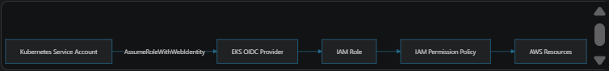
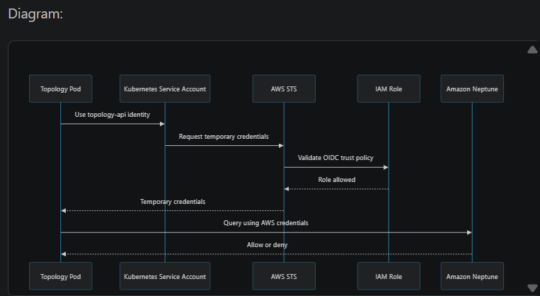

# AWS roles

## Simple IAM Model
Think of IAM as two separate questions:

```
1. Who is allowed to become this role?
   = Trust policy

2. What can the role do after becoming it?
   = Permission policy
```

The infrastructure follows this pattern:



For example:

```
Kubernetes service account:
system:serviceaccount:topology:topology-api

        assumes

IAM role:
ExchangeTopology-environment

        receives permissions from

IAM policy:
Neptune and S3 access

        accesses

Amazon Neptune and S3
```

## Which Module Creates What?

### 1. eks module: cluster and node roles
Located in terraform/modules/eks/main.tf.

This module creates the basic EKS infrastructure roles:

| Role | Trusted service | Purpose |
|---|---|---|
| `cluster-platform-<environment>` | `eks.amazonaws.com` | Allows the EKS control plane to manage the cluster |
| `node-group-platform-<environment>` | `EC2` | Allows worker nodes to operate |
| `admin-<environment>` | AWS account/control-plane admin role | Allows administrators to access the EKS cluster |


The EKS control-plane role receives:

```
AmazonEKSClusterPolicy
AmazonEKSVPCResourceController
```

The worker-node role receives:

```
AmazonEKSWorkerNodePolicy
AmazonEKS_CNI_Policy
AmazonEC2ContainerRegistryReadOnly
```

It also receives permission for:

`states:GetActivityTask`

The worker-node role is attached to the EC2 instances created for the EKS node group.

```
EKS control plane
    |
    +-- assumes cluster-platform role

EC2 worker nodes
    |
    +-- assume node-group-platform role
```

### 2. iam module: shared platform and Kubernetes add-on roles
The Exchange module calls the IAM module here:

terraform/modules/exchange/main.tf

The IAM module is responsible for platform-level Kubernetes roles and their policies. It creates roles for components such as:

- AWS Load Balancer Controller
- Cluster Autoscaler
- EBS CSI driver
- EFS CSI driver
- External DNS
- Cert-manager
- Prometheus
- OpenTelemetry
- Fluent Bit / CloudWatch
- External Secrets Operator
- Private CA integration

It first creates an EKS OIDC provider:

```
EKS cluster
   |
   v
OIDC provider
   |
   +-- allows Kubernetes service accounts to assume IAM roles
```

Examples:

```
kube-system/aws-load-balancer-controller
    -> AWS Load Balancer Controller IAM role
    -> Creates and manages ALBs/NLBs

kube-system/cluster-autoscaler
    -> Autoscaler IAM role
    -> Reads and changes Auto Scaling capacity

kube-system/ebs-csi-controller-sa
    -> EBS CSI IAM role
    -> Creates and manages EBS volumes

cert-manager/cert-manager
    -> Route 53 IAM role
    -> Creates DNS records for certificate validation

external-secrets-operator/external-secrets-operator
    -> Secrets Manager IAM role
    -> Reads configured secrets
```

These mappings are defined in terraform/modules/iam/main.tf.

### 3. iam_exchange_role module: application roles
This module creates IAM roles for Exchange workloads, but initially creates them without application permissions.

The Exchange module explicitly describes this separation:

```
iam_exchange_role:
    Create roles without policies

iam_exchange:
    Attach policies to roles
```

Roles are created in the iam_exchange_role module.

The iam_exchange module handles policy creation and attachment, while iam_exchange_role handles role creation.  The roles are created conditionally based on create_services.:

Conditional logic: count = contains(var.services, "service_name") ? 1 : 0
Trust policy template: policy_document.tftpl (sets up OIDC trust with Kubernetes)
Names like: ExchangeAttachment-${cluster_name}, ExchangeExport-${cluster_name}, etc.
The iam_exchange module then references these roles via the var.role_name_map variable, which maps role logical names to their actual ARNs/names created by iam_exchange_role.


The roles are created conditionally based on create_services.

Examples include:

| Role | Kubernetes service account | Main purpose |
|---|---|---|
| `ExchangeAttachment-<environment>` | `attachment:attachment` | Attachment bucket access |
| `ExchangeExport-<environment>` | `export:export` | Export bucket access |
| `ExchangeReportsEngine-<environment>` | `report:reportsengine` | Reporting, S3, Lambda, Step Functions |
| `ExchangeTopology-<environment>` | `topology:topology-api` | Neptune and S3 |
| `ExchangeFeatureToggler-<environment>` | `feature-toggler:feature-toggler-api` | IoT access |
| `secret-manager-<environment>` | External Secrets service account | Secret retrieval |
| `elastic-<environment>` | Elastic service account | Observability access |

The trust policy is defined in terraform/modules/iam_exchange_role/policy_document.tftpl.

It says, in effect:

```
Only this exact Kubernetes service account
in this exact namespace
from this exact EKS OIDC provider
may assume this role.
```

For example:

```
{
  "Action": "sts:AssumeRoleWithWebIdentity",
  "Principal": {
    "Federated": "EKS OIDC provider"
  },
  "Condition": {
    "sub": "system:serviceaccount:topology:topology-api",
    "aud": "sts.amazonaws.com"
  }
}
```

### 4. iam_exchange module: application permission policies
This module creates and attaches the actual permissions.

Located at terraform/modules/iam_exchange/main.tf.

The flow is:

```
iam_exchange_role
    creates role

iam_exchange
    creates policy
    attaches policy to role
```


Examples:


```
ExchangeAttachment role
    +-- S3 attachment bucket policy

ExchangeExport role
    +-- S3 export bucket policy

ExchangeReportsEngine role
    +-- S3 reporting policy
    +-- Step Functions policy

Reports Lambda role
    +-- Lambda policy
    +-- VPC access policy

Reports Step Functions role
    +-- Step Functions state-machine policy

ExchangeTopology role
    +-- Neptune policy
    +-- S3 topology policy

Batch Lambda role
    +-- Batch Lambda policy

Feature Toggler role
    +-- AWS IoT policy

Dynamic Secrets role
    +-- Secrets Manager policy
```

The resources are passed into the module through resources_arn_map, which is built in terraform/modules/exchange/main.tf.

That allows the policy to target the actual environment’s resources:

```
Environment-specific bucket ARN
Environment-specific Neptune ARN
Environment-specific Lambda ARN
Environment-specific MQ ARN
Environment-specific secret ARN
```

## How an Application Accesses AWS

Suppose the topology service needs to query Neptune.

1. A topology Pod starts in EKS.

2. The Pod uses the Kubernetes service account:
   topology:topology-api

3. The service account is configured with:
   ExchangeTopology-<environment>

4. AWS STS validates the EKS OIDC token.

5. IAM checks the role trust policy.

6. The Pod receives temporary AWS credentials.

7. The Pod uses those credentials to call Neptune.

8. Neptune access is allowed or denied by the attached IAM policy.




The Pod does not need permanent AWS access keys inside its container.


## Why This Design Is Useful

### Least privilege
Each service receives only the permissions it needs.

```
Attachment service -> attachment S3 access
Topology service   -> Neptune and topology S3 access
Reporting service  -> reporting S3 and Step Functions access
```

A compromised reporting Pod should not automatically receive the topology service’s permissions.

### No static AWS keys in Pods
The Pod obtains short-lived credentials through STS and the EKS OIDC provider.

```
No hard-coded AWS_ACCESS_KEY_ID
No hard-coded AWS_SECRET_ACCESS_KEY
Temporary credentials
```

This reduces the impact of leaked application credentials.

### Separation of responsibilities

The code separates:

```
Role creation:
iam_exchange_role

Permission creation and attachment:
iam_exchange

EKS/platform roles:
iam and eks
```

This makes it easier to review:

```
Who may assume the role?
What can the role access?
Which service receives the role?
```

### Conditional infrastructure

Roles and policies are created only when the related service is enabled:

`create_services = ["adminservices"]`

creates a smaller IAM footprint than:

```
create_services = [
  "adminservices",
  "reporting",
  "topology",
  "equipmentservices"
]
```

The same pattern controls optional roles for Batch, IoT, Neptune, reporting, dynamic secrets, and Elastic monitoring.

### Easier multi-environment deployment

Role names include the cluster or environment:

```
ExchangeTopology-dev
ExchangeTopology-qa
ExchangeTopology-prod
```

Policies can point to environment-specific ARNs, reducing accidental access between environments.

## Administrator and CI/CD Access
There is a separate GitLab OIDC module:

terraform/modules/aws_oidc_gitlab/main.tf

Its flow is:

```
GitLab CI job
    |
    | OIDC token
    v
AWS IAM OIDC provider for GitLab
    |
    v
GitlabRunner role
    |
    v
AWS permissions
```

The current module attaches:

`AdministratorAccess`

to the GitLab runner role. That is convenient for infrastructure deployment, but it is much broader than the application roles and should be treated as a high-privilege deployment identity.

## One-Sentence Summary

`EKS and IAM create the identities, iam_exchange_role defines who may assume application roles, iam_exchange defines what those roles can do, and Kubernetes Pods use short-lived STS credentials to access only their assigned AWS resources.`

`One caveat visible in the code is that some policies are intentionally broad, including wildcard resources for certain IoT, KMS, monitoring, and legacy service permissions. The architecture supports least privilege, but the individual policies still need periodic review.`